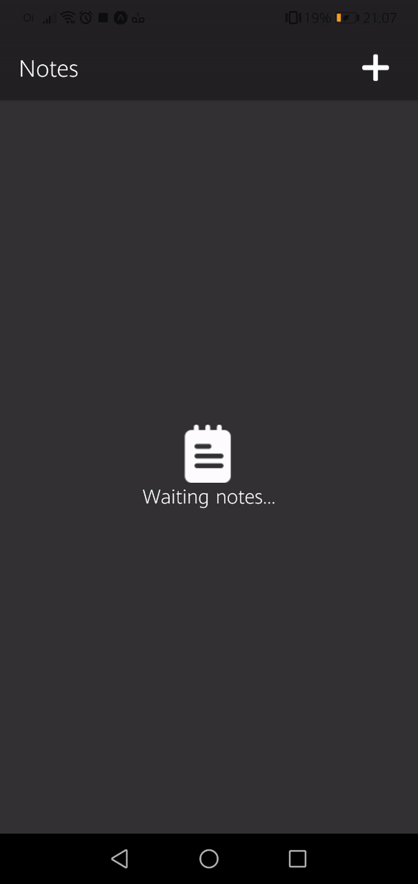

# <p align="center"> 📑 Dev Notes </p>
<br />

# 🐱‍👤 Sobre

Um aplicativo criado em React-Native e Redux, para criar, editar e 
excluir notas digitadas pelo usuário, auxiliando
as tarefas do dia-a-dia.<br />

<div align="center">

</div> <br />
# 🔧 Ferramentas

* <a href="https://reactnative.dev/">React-Native</a>

* <a href="https://reactnavigation.org/">React-Navigation</a><br />

* <a href="https://redux.js.org/">ReduxJS</a><br />

* <a href="https://code.visualstudio.com/">Visual Studio Code</a>

* <a href="https://styled-components.com/">Styled Components</a><br />


# 🎱 Atributos 

* Usuário entra com a nota.

* Armazena as notas em memória local. 

* Usuário edita a nota. 

* Usuário exclui a nota.
<br/>

# 🏴‍☠️Como utilizar

  ```sh
$ git clone https://github.com/Scrowszinho/DevNotes
  ```

```sh
$ npm install
$ expo start
```